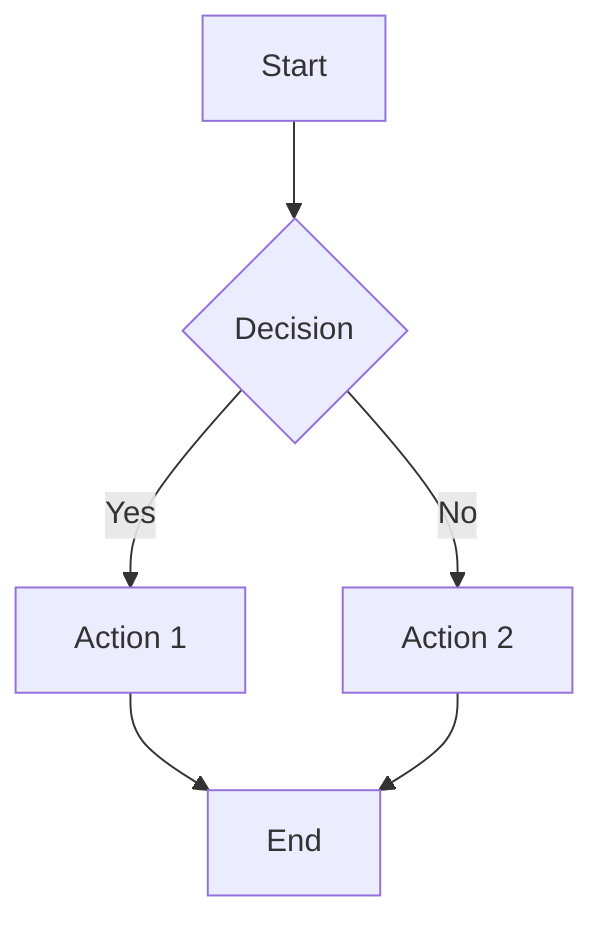
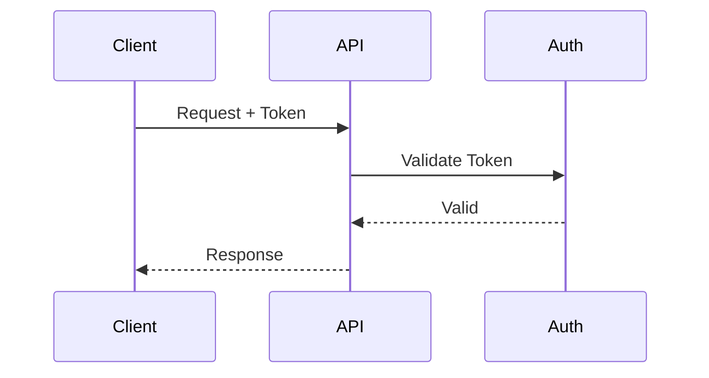

# SVG Graphics Skill

Generate branded, accessible SVG graphics that enhance blog content and serve as social media previews.

## Purpose

Create visual assets for blog content including:
1. **Social preview images** (hero graphics for Open Graph/Twitter Cards)
2. **Technical diagrams** (flowcharts, architecture, sequence diagrams)
3. **Data visualizations** (charts, comparison graphics)
4. **Styled tables** (convert markdown tables to branded SVG)
5. **Conceptual illustrations** (visual abstracts for article topics)

All graphics use the zircote brand palette and include full accessibility features.

## Triggers

### Explicit Triggers
- "create social preview for [post]"
- "generate diagram for [concept]"
- "add flowchart showing [process]"
- "create hero image"
- "visualize this architecture"
- "convert mermaid to svg"
- "make this table visual"
- "/svg-graphics"

### Auto-Triggers (during content creation)
- Blog post lacks `image:` frontmatter
- Content contains ```` ```mermaid ```` blocks
- Content describes processes, flows, or architectures
- Markdown tables with 4+ columns or comparison data
- Technical concepts that benefit from visualization

## Brand Design System

### Color Palette (MANDATORY)

| Name | Hex | RGB | Usage |
|------|-----|-----|-------|
| Rust | `#8E4432` | rgb(142, 68, 50) | Primary accent, headings, key elements |
| Purple | `#74657E` | rgb(116, 101, 126) | Secondary accent, supporting elements |
| Dusty Rose | `#CAA094` | rgb(202, 160, 148) | Highlights, backgrounds, subtle accents |
| Charcoal | `#4A4A4A` | rgb(74, 74, 74) | Text, labels, borders |
| Off-White | `#F9F3F4` | rgb(249, 243, 244) | Backgrounds, negative space |

### Typography

- **Primary font**: System sans-serif stack (`-apple-system, BlinkMacSystemFont, 'Segoe UI', Roboto, sans-serif`)
- **Code/monospace**: `'SF Mono', 'Fira Code', 'JetBrains Mono', monospace`
- **Title size**: 48-64px for social previews
- **Body text**: 16-24px for diagram labels

### Visual Style: Builder's Workshop

- Terminal aesthetics made beautiful
- Clean lines with subtle texture
- Monospace typography for technical content
- Minimal decoration, maximum clarity
- High contrast for accessibility

---

## Output Specifications

### Social Preview Images

| Property | Value |
|----------|-------|
| Dimensions | 1280x640 pixels |
| Aspect ratio | 2:1 |
| Format | SVG source + PNG export |
| File location | `assets/images/posts/{slug}/hero.svg` and `hero.png` |
| Content | Post title + visual abstract |

**Critical**: Open Graph does NOT support SVG. Always generate PNG alongside SVG for `og:image`.

### Inline Diagrams

| Property | Value |
|----------|-------|
| Max width | 800px (responsive) |
| Format | SVG only |
| File location | `assets/images/posts/{slug}/diagram-{n}.svg` |
| Naming | Descriptive: `auth-flow.svg`, `architecture.svg` |

### Accessibility Requirements (MANDATORY)

All SVGs MUST include:

```xml
<svg role="img" aria-labelledby="title-id desc-id" ...>
  <title id="title-id">Concise title describing the graphic</title>
  <desc id="desc-id">Detailed description of what the graphic shows</desc>
  <!-- graphic content -->
</svg>
```

For decorative-only graphics:
```xml
<svg aria-hidden="true" role="presentation" ...>
```

---

## SVG Generation Patterns

### Pattern 1: Social Preview Hero Image

Generate a hero image with post title and visual abstract.

```xml
<svg xmlns="http://www.w3.org/2000/svg" viewBox="0 0 1280 640" role="img" aria-labelledby="hero-title hero-desc">
  <title id="hero-title">{Post Title}</title>
  <desc id="hero-desc">Social preview image for blog post about {topic}</desc>

  <!-- Background -->
  <rect width="1280" height="640" fill="#F9F3F4"/>

  <!-- Decorative element (top accent) -->
  <rect width="1280" height="8" fill="#8E4432"/>

  <!-- Visual abstract area (left 60%) -->
  <g transform="translate(60, 100)">
    <!-- Topic-specific illustration here -->
  </g>

  <!-- Title area (right 40%) -->
  <g transform="translate(800, 200)">
    <text font-family="-apple-system, sans-serif" font-size="48" font-weight="600" fill="#4A4A4A">
      <tspan x="0" y="0">{Title Line 1}</tspan>
      <tspan x="0" y="60">{Title Line 2}</tspan>
    </text>

    <!-- Author/brand -->
    <text y="200" font-family="monospace" font-size="18" fill="#74657E">
      zircote.com
    </text>
  </g>
</svg>
```

### Pattern 2: Flowchart/Process Diagram

```xml
<svg xmlns="http://www.w3.org/2000/svg" viewBox="0 0 800 400" role="img" aria-labelledby="flow-title flow-desc">
  <title id="flow-title">{Process Name} Flow</title>
  <desc id="flow-desc">Flowchart showing {detailed description}</desc>

  <defs>
    <!-- Arrow marker -->
    <marker id="arrow" markerWidth="10" markerHeight="10" refX="9" refY="3" orient="auto">
      <path d="M0,0 L0,6 L9,3 z" fill="#4A4A4A"/>
    </marker>

    <!-- Node styles -->
    <style>
      .node { fill: #F9F3F4; stroke: #8E4432; stroke-width: 2; }
      .node-text { font-family: -apple-system, sans-serif; font-size: 14px; fill: #4A4A4A; }
      .connector { stroke: #4A4A4A; stroke-width: 2; fill: none; marker-end: url(#arrow); }
    </style>
  </defs>

  <!-- Nodes -->
  <g class="node">
    <rect x="50" y="50" width="120" height="60" rx="8"/>
    <text class="node-text" x="110" y="85" text-anchor="middle">Start</text>
  </g>

  <!-- Connectors -->
  <path class="connector" d="M170,80 L230,80"/>

  <!-- Additional nodes... -->
</svg>
```

### Pattern 3: Architecture Diagram

```xml
<svg xmlns="http://www.w3.org/2000/svg" viewBox="0 0 800 500" role="img" aria-labelledby="arch-title arch-desc">
  <title id="arch-title">{System} Architecture</title>
  <desc id="arch-desc">Architecture diagram showing {components and relationships}</desc>

  <defs>
    <style>
      .layer { fill: #F9F3F4; stroke: #74657E; stroke-width: 1; }
      .component { fill: white; stroke: #8E4432; stroke-width: 2; rx: 4; }
      .label { font-family: monospace; font-size: 12px; fill: #4A4A4A; }
      .layer-label { font-family: -apple-system, sans-serif; font-size: 14px; font-weight: 600; fill: #8E4432; }
    </style>
  </defs>

  <!-- Layer: Presentation -->
  <g>
    <rect class="layer" x="50" y="50" width="700" height="100" rx="4"/>
    <text class="layer-label" x="70" y="75">Presentation Layer</text>

    <rect class="component" x="100" y="90" width="100" height="40"/>
    <text class="label" x="150" y="115" text-anchor="middle">Component</text>
  </g>

  <!-- Additional layers... -->
</svg>
```

### Pattern 4: Styled Table

Convert markdown tables to branded SVG for visual impact.

```xml
<svg xmlns="http://www.w3.org/2000/svg" viewBox="0 0 600 300" role="img" aria-labelledby="table-title table-desc">
  <title id="table-title">{Table Subject} Comparison</title>
  <desc id="table-desc">Table comparing {items} across {criteria}</desc>

  <defs>
    <style>
      .header { fill: #8E4432; }
      .header-text { font-family: -apple-system, sans-serif; font-size: 14px; font-weight: 600; fill: white; }
      .row-even { fill: #F9F3F4; }
      .row-odd { fill: white; }
      .cell-text { font-family: -apple-system, sans-serif; font-size: 13px; fill: #4A4A4A; }
      .border { stroke: #CAA094; stroke-width: 1; }
    </style>
  </defs>

  <!-- Header row -->
  <rect class="header" x="0" y="0" width="600" height="40"/>
  <text class="header-text" x="20" y="26">Column 1</text>
  <text class="header-text" x="220" y="26">Column 2</text>
  <text class="header-text" x="420" y="26">Column 3</text>

  <!-- Data rows -->
  <rect class="row-odd" x="0" y="40" width="600" height="40"/>
  <text class="cell-text" x="20" y="66">Value 1</text>

  <!-- Grid lines -->
  <line class="border" x1="200" y1="0" x2="200" y2="300"/>
  <line class="border" x1="400" y1="0" x2="400" y2="300"/>
</svg>
```

### Pattern 5: Mermaid Conversion

Convert Mermaid syntax to branded SVG.

**Input** (in markdown):
````markdown

````

**Process**:
1. Extract Mermaid code from markdown
2. Apply brand theme configuration
3. Render to SVG using mermaid-cli or API
4. Post-process to add accessibility attributes
5. Save to `assets/images/posts/{slug}/`

**Mermaid Theme Configuration**:
```javascript
{
  theme: 'base',
  themeVariables: {
    primaryColor: '#8E4432',
    primaryTextColor: '#4A4A4A',
    primaryBorderColor: '#8E4432',
    secondaryColor: '#74657E',
    tertiaryColor: '#F9F3F4',
    lineColor: '#4A4A4A',
    textColor: '#4A4A4A',
    fontFamily: '-apple-system, BlinkMacSystemFont, sans-serif'
  }
}
```

---

## Placement Logic

### Semantic Analysis Rules

When auto-detecting where to insert graphics:

1. **Social preview**: Always at document level (frontmatter `image:`)
2. **Process diagrams**: After paragraphs describing steps or workflows
3. **Architecture diagrams**: After "architecture", "structure", or "components" sections
4. **Comparison tables**: Replace or follow markdown tables with 4+ columns
5. **Concept illustrations**: After abstract explanations, before detailed implementation

### Placement Markers (Optional)

Authors can explicitly request graphics:

```markdown
<!-- svg: flowchart showing authentication process -->

<!-- svg: architecture diagram for API layer -->

<!-- svg: table visualization -->
```

---

## File Organization

```
assets/
└── images/
    └── posts/
        └── {post-slug}/
            ├── hero.svg           # Social preview source
            ├── hero.png           # Social preview (og:image)
            ├── auth-flow.svg      # Named diagram
            ├── architecture.svg   # Named diagram
            └── table-comparison.svg
```

### Naming Conventions

| Type | Pattern | Example |
|------|---------|---------|
| Social preview | `hero.svg`, `hero.png` | `hero.svg` |
| Flowcharts | `{subject}-flow.svg` | `auth-flow.svg` |
| Architecture | `{system}-architecture.svg` | `api-architecture.svg` |
| Sequence | `{process}-sequence.svg` | `login-sequence.svg` |
| Tables | `{subject}-comparison.svg` | `tools-comparison.svg` |
| Generic | `diagram-{n}.svg` | `diagram-1.svg` |

---

## Frontmatter Updates

When generating a social preview, auto-update post frontmatter:

```yaml
---
title: "Post Title"
date: 2025-01-15
image: /assets/images/posts/post-slug/hero.png
image_alt: "Visual representation of [topic]"
og:
  image: /assets/images/posts/post-slug/hero.png
  image_width: 1280
  image_height: 640
twitter:
  card: summary_large_image
  image: /assets/images/posts/post-slug/hero.png
---
```

---

## Validation

### SVG Validation Checklist

- [ ] Valid SVG 1.1 syntax
- [ ] `viewBox` attribute present
- [ ] `role="img"` for informative graphics
- [ ] `<title>` element present and descriptive
- [ ] `<desc>` element present for complex graphics
- [ ] `aria-labelledby` references title and desc IDs
- [ ] Only brand colors used (#8E4432, #74657E, #CAA094, #4A4A4A, #F9F3F4, white)
- [ ] File size under 50KB for inline graphics
- [ ] No external dependencies (fonts embedded or system fonts)
- [ ] PNG export exists for social previews

### Validation Command

```bash
# Validate SVG files
node scripts/validate-svg-graphics.js assets/images/posts/

# Check specific post
node scripts/validate-svg-graphics.js assets/images/posts/my-post-slug/
```

---

## Integration with Content Pipeline

### Workflow

1. **Content creation begins** (via content-pipeline skill)
2. **SVG skill auto-triggers** when:
   - Post lacks hero image
   - Mermaid blocks detected
   - Complex concepts identified
3. **Graphics generated** with brand styling
4. **Frontmatter updated** with image paths
5. **Validation runs** before PR
6. **Human-voice skill** validates any text in graphics

### Pre-Publish Checklist Addition

- [ ] Social preview image generated (`hero.png`)
- [ ] All diagrams use brand colors
- [ ] SVG accessibility attributes present
- [ ] Frontmatter `image:` field populated
- [ ] PNG exports exist for og:image

---

## Technical Implementation

### Dependencies

```json
{
  "devDependencies": {
    "@mermaid-js/mermaid-cli": "^10.x",
    "sharp": "^0.33.x",
    "svgo": "^3.x"
  }
}
```

### SVG to PNG Conversion

```javascript
const sharp = require('sharp');

async function svgToPng(svgPath, pngPath, width = 1280, height = 640) {
  await sharp(svgPath)
    .resize(width, height)
    .png()
    .toFile(pngPath);
}
```

### Mermaid Rendering

```javascript
const { run } = require('@mermaid-js/mermaid-cli');

async function renderMermaid(mmdContent, outputPath) {
  // Write temp .mmd file
  // Run with brand theme config
  // Post-process for accessibility
  await run(tempFile, outputPath, {
    puppeteerConfig: { headless: 'new' },
    parseMMDOptions: { mermaidConfig: brandTheme }
  });
}
```

### SVGO Optimization

```javascript
const { optimize } = require('svgo');

const result = optimize(svgString, {
  plugins: [
    'preset-default',
    { name: 'removeTitle', active: false }, // Keep title for a11y
    { name: 'removeDesc', active: false },  // Keep desc for a11y
  ]
});
```

---

## Examples

### Example 1: Generate Social Preview

**Request**: "Create a social preview for my post about API authentication"

**Output**:
- `assets/images/posts/api-authentication/hero.svg`
- `assets/images/posts/api-authentication/hero.png`
- Frontmatter updated with `image:` path

### Example 2: Convert Mermaid Diagram

**Input** (in blog post):
````markdown

````

**Output**:
- `assets/images/posts/post-slug/auth-sequence.svg`
- Mermaid block replaced with ``

### Example 3: Table Visualization

**Input**:
```markdown
| Tool | Speed | Learning Curve | Community |
|------|-------|----------------|-----------|
| Tool A | Fast | Steep | Large |
| Tool B | Medium | Gentle | Growing |
| Tool C | Slow | Minimal | Small |
```

**Output**:
- `assets/images/posts/post-slug/tools-comparison.svg`
- Original table optionally replaced or supplemented

---

## Related Skills

- `content-pipeline` - Content creation workflow (triggers svg-graphics)
- `human-voice` - Validates text within graphics
- `template-creation` - Template development

---

## Sources

Research compiled from:
- [SVG Generation Methods Comparison](https://www.svgai.org/blog/svg-generation/svg-generation-methods-comparison)
- [Vercel Satori - HTML/CSS to SVG](https://github.com/vercel/satori)
- [Sharp - High performance image processing](https://sharp.pixelplumbing.com/)
- [Mermaid CLI](https://github.com/mermaid-js/mermaid-cli)
- [Open Graph Image Sizes 2025](https://www.krumzi.com/blog/open-graph-image-sizes-for-social-media-the-complete-2025-guide)
- [SVG Accessibility - A11Y Collective](https://www.a11y-collective.com/blog/svg-accessibility/)
- [Using ARIA to enhance SVG accessibility](https://www.tpgi.com/using-aria-enhance-svg-accessibility/)
- [MDN SVG Documentation](https://developer.mozilla.org/en-US/docs/Web/SVG)
